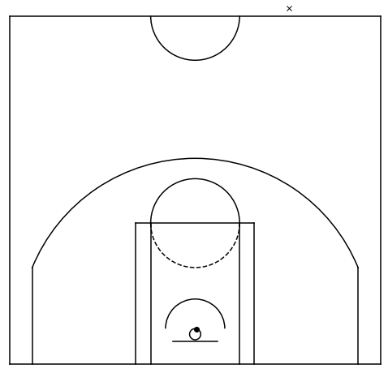
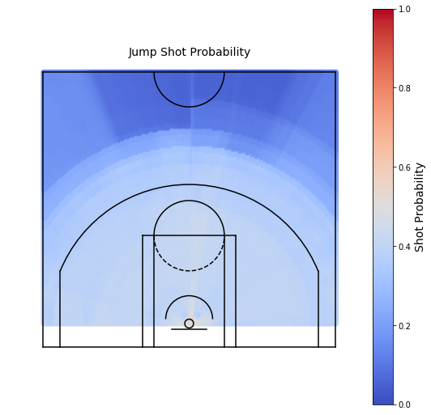
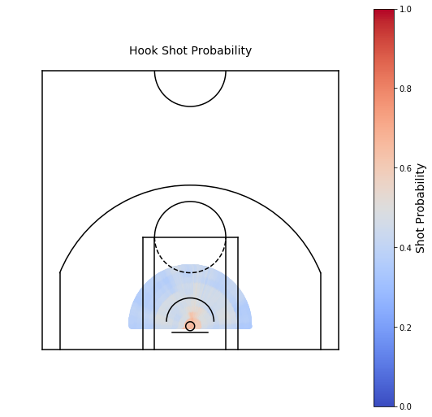
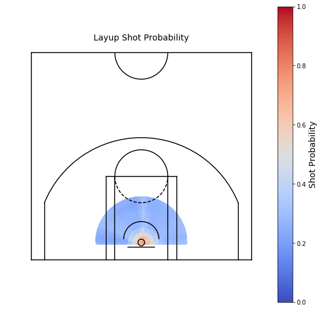
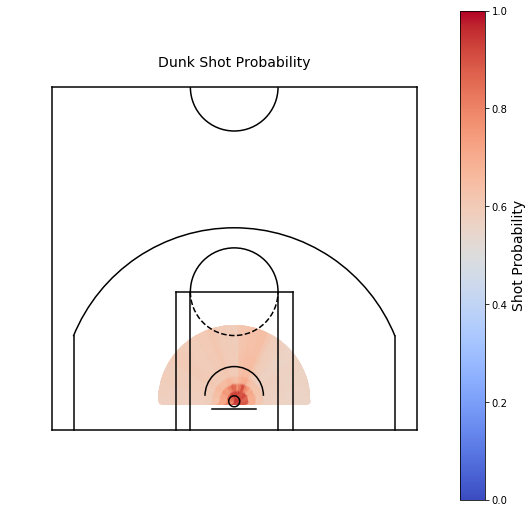
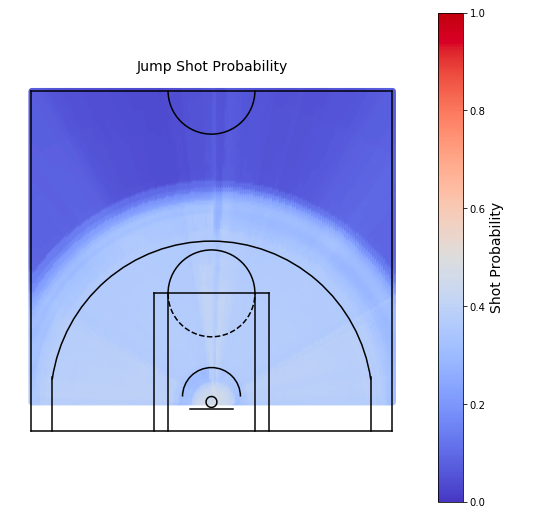
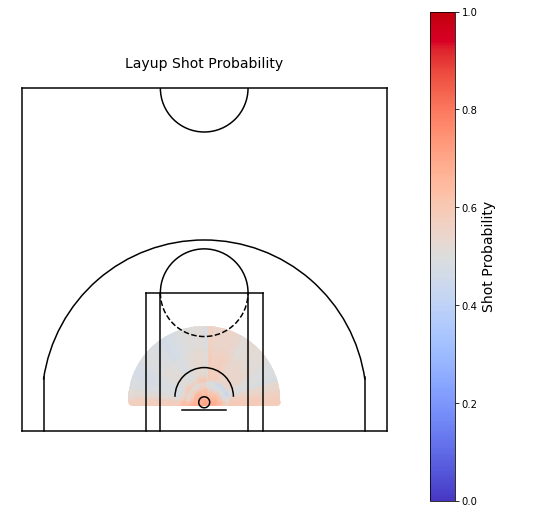

# shot_probability
Building a shot probability model from WNBA and NBA shot chart data

## Description

This repo contains a notebook (`shot_probability.ipynb`) that explores the `shotchartdetail` endpoint of the [stats.nba.com](https://stats.nba.com) API. With the `Player` class of the `py_ball` package, a shot probability random forest model is built, tested, and evaluated.

The shot probability model only considers features that describe the location and type of shot. There is no player skill or game state information contained in the model.

## NBA Results

The image below show two shots from the test set, one with a 97% make probability and the other with a 5% make probability. The high probability shot is a dunk at the rim, while the low probability shot is a halfcourt heave.

With the model working well in the extremes, examining the shot probability by location and shot type should provide a more comprehensive model diagnostic.

### Jump Shots

The shot probability for a jump shot decreases gradually as the shot distance increases.

### Hook Shots

The shot probability for a hook shot is very high close to the rim and remains so for a reasonable distance from the basket. The arc of shot probability here is a semicircle with a radius of 10 feet.

### Layups

The shot probability for a layup decreases very quickly beyond the immediate vicinity of the basket.

### Dunks

The shot probability for a dunk is quite high, which agrees with intuition.

## WNBA Results

### Jump Shots

The shot probability map looks very similar to the NBA one, with a gradual decrease in shot probability followed by a large drop far from the three-point line.

### Layups

Layups are very high probability shots immediately around the basket, but otherwise are similar to close jump shots.

