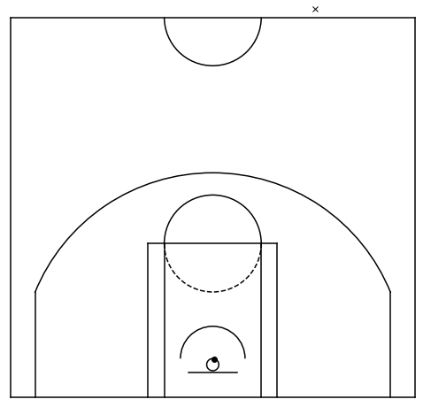
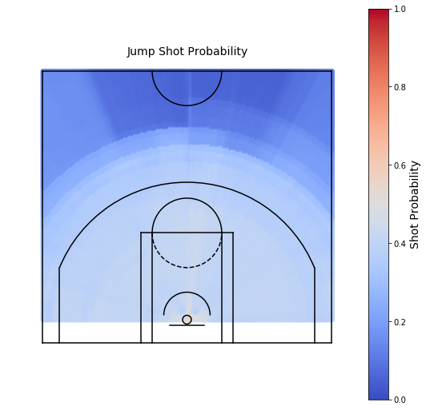
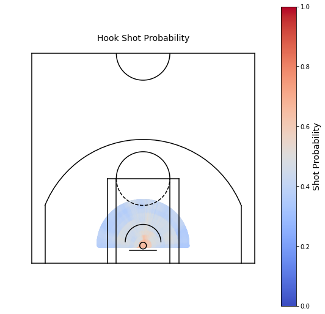
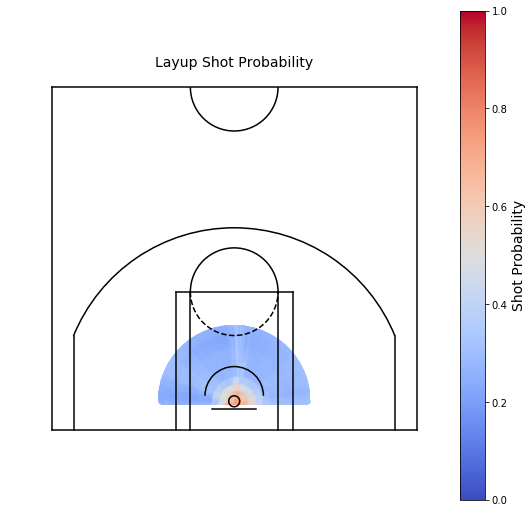
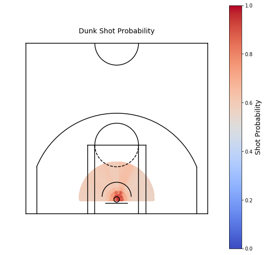

# shot_probability
Building a shot probability model from NBA shot chart data

## Description

This repo contains a notebook (`shot_probability.ipynb`) that explores the `shotchartdetail` endpoint of the [stats.nba.com](https://stats.nba.com) API. With the `Player` class of the `py_ball` package, a shot probability random forest model is built, tested, and evaluated.

## Results

The image below show two shots from the test set, one with a 97% make probability and the other with a 5% make probability. The high probability shot is a dunk at the rim, while the low probability shot is a halfcourt heave.

With the model working well in the extremes, examining the shot probability by location and shot type should provide a more comprehensive model diagnostic.

### Jump Shots

The shot probability for a jump shot decreases gradually as the shot distance increases.

### Hook Shots

The shot probability for a hook shot 

### Layups

The shot probability for a layup

### Dunks

The shot probability for a dunk
